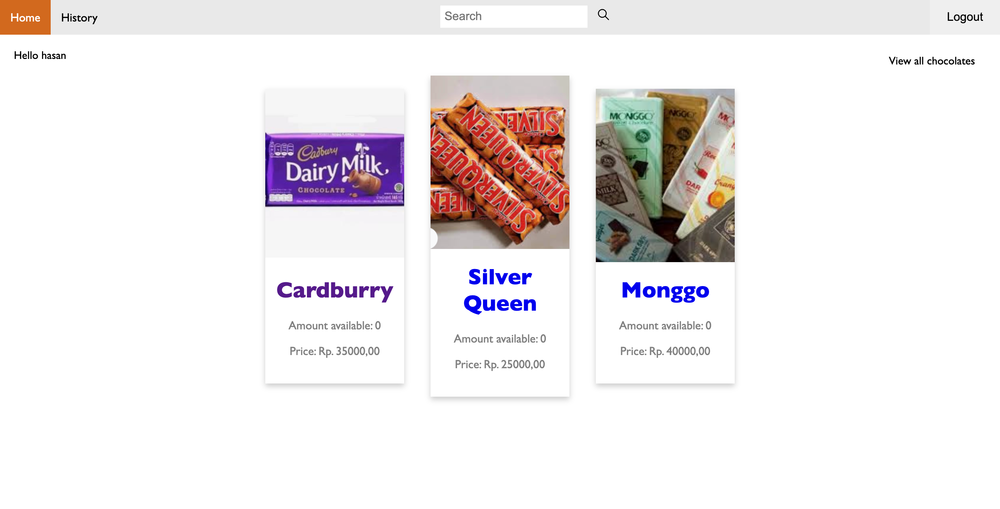

# Tugas 1 IF3110 Pengembangan Aplikasi Berbasis Web

## Deskripsi
Willi Wangky Choco Factory merupakan aplikasi jual beli coklat online berbasis web. Aplikasi ini dibuat menggunakan bahasa PHP pada backend dan HTML, CSS, serta Javascript pada frontend. Aplikasi ini memiliki 2 role yaitu user (sebagai pengguna) dan super user (sebagai pengelola toko online).
Aplikasi ini memiliki fitur :
1. Login User dan Super User
2. Registrasi User
3. Dashboard yang berisi coklat yang dijual
4. Pencarian coklat berdasar nama
5. Menambahkan coklat baru(untuk super user)
6. Menambah stok coklat yang sudah ada (untuk super user)
7. Membeli coklat
8. Melihat history pembelian

## Requirement
1. PHP
2. HTML
3. CSS
5. Javascript

## Basisdata
Web ini menggunakan basisdata MySQL yang skema pembuatannya terdapat pada create_table.txt. Perubahan yang dilakukan dari database sebelumnya yaitu menambahkan tabel add_stok untuk mencatat history penambahan stok. Pengguna dapat mengimport database yang terdapat pada data/willy_wangky.sql untuk data awal.

## How to Run
1. Clone repository dan masuk ke direktori repository
2. Setup database dengan mengimport database pada `data/willy_wangky.sql`
3. Setting host, nama, username dan password database pada `src/models/config_db.php` 
4. Eksekusi script `php -S localhost:8083`
5. Buka [localhost](http://localhost:8083)

## Tampilan aplikasi

Berikut adalah tampilan aplikasi yang telah dibuat

### Halaman Login

### Halaman Register

### Halaman Dashboard

### Halaman Buy Chocolate

### Halaman Search Result

### Halaman History

### Halaman Add Stock

### Halaman Add New Chocolate
Halaman lama :

Halaman baru :

## Pembagian Tugas

### REST
1. Transaksi dengan WS-Factory - 13518019, 13518012
2. Daftar bahan dan harga - 13518022

### SOAP
1. Fungsi getAllChocolate - 13518019
2. Fungsi addChocolate - 13518019
3. Fungsi produceChocolate - 13518022, 13518012
4. Fungsi isUserExist - 13518019
5. Fungsi getAllBahan - 13518022
6. Fungsi getAllResep - 13518022
7. Fungsi addBahan - 13518022
8. Fungsi getSaldo - 13518012
9. Fungsi setSaldo - 13518012
10. Fungsi addSaldo - 13518012
11. Fungsi addStock - 13518019
12. Fungsi approveAddStock - 13518019
13. Fungsi getAllReqAddStock - 13518019
14. Fungsi checkStatus - 13518019

### ReactJS
1. Navigation Bar - 13518012
2. Halaman Daftar Pemesan Coklat - 13518019
3. Halaman Coklat yang tersedia di pabrik - 13518012
4. Halaman Daftar Bahan - 13518012
5. Halaman Daftar Resep Coklat - 13518012
6. Halaman Daftar Permintaan Penambahan Stok Coklat - 13518019
7. Halaman Lihat Saldo - 13518012
8. Halaman Beli Bahan - 13518022
9. Halaman Produksi Coklat - 13518019
10. Halaman Login - 13518022

### Perubahan Willy Wangky's Web
1. Halaman Add New Chocolate - 13518012, 13518022
2. Request Add Stock + database - 13518019
3. Cek berkala Approval Add Stock - 13518019, 13518022
4. Penambahan saldo pada WS Factory - 13518019

## Author
13518012 | Muhammad Hasan \
13518019 | Muhammad Zunan Alfikri \
13518022 | Fabian Zhafransyah